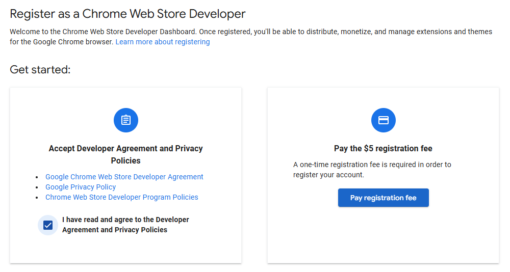
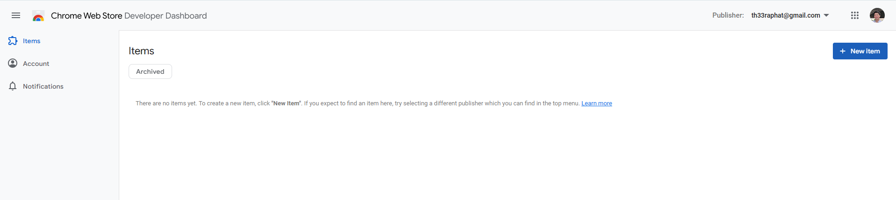
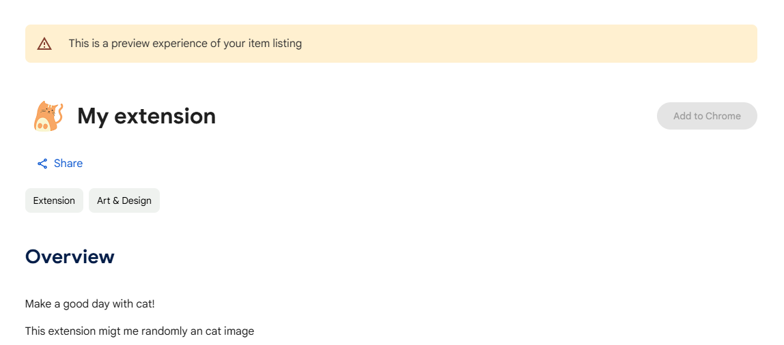

# How to create simple and upload chrome extension

1. Create project structure

### Project 

```
Project
|
| - index.html (Loaded an chrome extension view)
| - manifest.json

```

### Manifest extension

```
{
  "name": "My extension",
  "version": "1.0.0",
  "description": "Make a good day with cat!",
  "manifest_version": 3,
  "author": "TheeraphatStudent",
  "action": {
    "default_popup": "index.html",
    "default_title": "Simple extension"
  },
  "host_permissions": [
    "https://*/*"
  ],
  "permissions": [ ... ]
}
```

you can see permission [here](https://developer.chrome.com/docs/extensions/develop/concepts/declare-permissions?hl=en)


2. Open browser then go find extension > manage extension

3. Open developer mode

4. Load unpacked

5. Select an chrome extension project

6. Then find extension and open it, Done!

### After followed this step and got error
on extension you can see on error in extension, try to open it <br>
in my case, i get `Refused to execute inline script because it violates the following Content Security Policy directive...` so let fixed!

1. Find way to avoid using the [CSP](https://developer.mozilla.org/en-US/docs/Web/HTTP/Guides/CSP)

2. 

### To public private chrome extension to public

1. Go to [web store](https://developer.chrome.com/docs/webstore/publish?hl=en) developer

2. Payment for register developer on chrome extension



3.Then open developer dashboard



4. CLicked on new item then compress you project to zip file

5. Fill all detail requirement and done!

